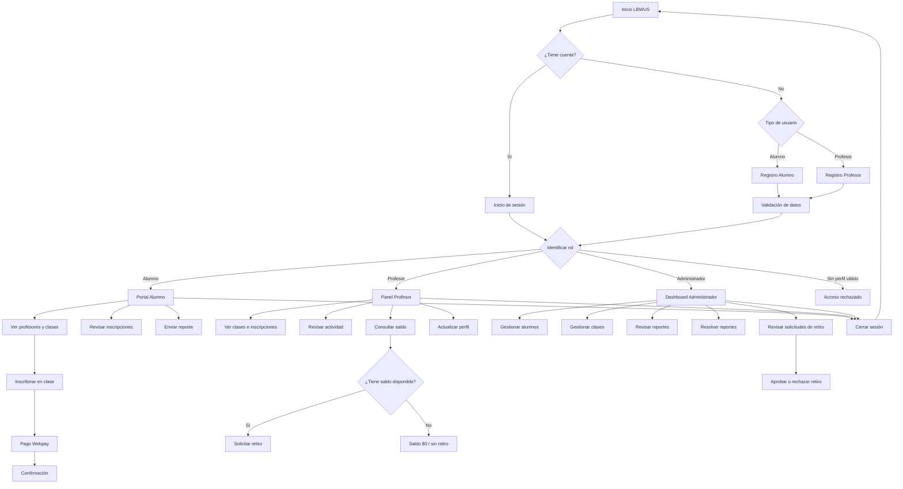

# 2.4 — Experiencia y flujo de usuario

## Objetivo

Definir y validar el recorrido de los principales usuarios de LBWUS dentro del MVP, identificando sus acciones principales, puntos de decisión, validaciones y caminos alternativos. El propósito es asegurar que la navegación sea coherente y que cada usuario acceda únicamente a las funcionalidades correspondientes a su perfil.

---

## 1. Flujo general de acceso

Todos los usuarios comienzan desde la página de inicio de LBWUS.

**Flujo principal:**

Inicio → Selección de usuario → Registro o Inicio de sesión → Validación de credenciales → Identificación del rol → Redirección al portal correspondiente.

El sistema utiliza un inicio de sesión centralizado y determina si la cuenta corresponde a:

- Alumno
- Profesor
- Administrador

Una vez identificado el perfil, el usuario es enviado automáticamente a su panel correspondiente.

**Flujos alternativos:**

- Credenciales incorrectas → se informa el error y se mantiene al usuario en el login.
- Campos incompletos → se solicita completar la información requerida.
- Usuario autenticado sin perfil asociado → no obtiene acceso a ningún panel.
- Intento de ingresar a un portal sin sesión → redirección al inicio de sesión.
- Cierre de sesión → eliminación de la sesión y retorno al inicio.

---

## 2. Flujo Alumno

### Flujo principal

Inicio  
→ Registrarse como alumno / Iniciar sesión  
→ Validación de datos  
→ Portal del alumno  
→ Visualización de profesores y clases disponibles  
→ Selección de clase  
→ Inscripción  
→ Gestión de clases inscritas  
→ Pago mediante Webpay cuando corresponda  
→ Confirmación del proceso.

Desde su portal el alumno también puede revisar sus inscripciones y generar reportes relacionados con la plataforma.

### Flujos alternativos

- Datos de registro inválidos → se informa el campo con error.
- RUT o correo ya registrado → registro rechazado.
- Login incorrecto → mensaje de credenciales incorrectas.
- Alumno sin sesión → redirección al login.
- Clase ya inscrita o inscripción inválida → operación rechazada.
- Cancelación de inscripción → actualización de las clases del alumno.
- Problema durante el pago → el usuario no debe considerar la operación como confirmada.
- Reporte vacío → el sistema no permite enviarlo.

---

## 3. Flujo Profesor

### Flujo principal

Inicio  
→ Registrarse como profesor / Iniciar sesión  
→ Validación de datos  
→ Panel del profesor  
→ Visualización de clases e inscripciones  
→ Revisión de actividad  
→ Visualización de saldo generado  
→ Actualización de perfil  
→ Solicitud de retiro cuando existe saldo disponible.

El saldo del profesor se calcula a partir de inscripciones reales. Una cuenta nueva sin actividad comienza con saldo $0.

### Flujos alternativos

- Campos obligatorios incompletos → registro rechazado.
- Contraseñas diferentes → se informa el error.
- Contraseña menor al mínimo requerido → registro rechazado.
- RUT inválido → registro rechazado.
- RUT o correo existente → registro rechazado.
- Profesor menor de 18 años → registro rechazado.
- Credenciales incorrectas → no se inicia sesión.
- Acceso al panel sin sesión de profesor → redirección.
- Sin inscripciones → métricas de actividad y saldo permanecen en 0.
- Solicitud de retiro sin saldo → operación rechazada.
- Solicitud superior al saldo disponible → operación rechazada.

> La acreditación o validación documental del profesor queda pendiente de definición funcional por parte del equipo y no forma parte del flujo implementado actualmente.

---

## 4. Flujo Administrador

### Flujo principal

Inicio de sesión  
→ Validación de perfil administrador  
→ Dashboard administrativo  
→ Visualización de alumnos, profesores, clases y reportes  
→ Gestión de alumnos  
→ Gestión de clases  
→ Resolución de reportes  
→ Revisión de solicitudes de retiro  
→ Aprobación o rechazo de solicitudes.

El registro de nuevos administradores no se encuentra disponible para usuarios públicos y requiere permisos administrativos.

### Flujos alternativos

- Usuario sin sesión administrativa → redirección al login.
- Usuario staff sin perfil administrador asociado → acceso rechazado.
- Intento público de crear un administrador → operación rechazada.
- Alumno inexistente en una operación CRUD → se informa que el registro no existe.
- Datos incompletos al crear una clase → operación rechazada.
- Solicitud de retiro inexistente → no se procesa.

---

## 5. Flujo resumido por rol

### Alumno

Inicio → Registro/Login → Portal → Profesores/Clases → Inscripción → Pago → Confirmación → Gestión de inscripción.

### Profesor

Inicio → Registro/Login → Panel → Clases/Alumnos → Actividad → Saldo → Solicitud de retiro.

### Administrador

Login → Dashboard → Gestión de usuarios/clases → Reportes → Solicitudes de retiro → Aprobar/Rechazar.

---

## 6. Relación con la experiencia TO-BE

El flujo propuesto para LBWUS busca concentrar en una sola plataforma actividades que normalmente requieren búsquedas, coordinación y gestiones separadas entre estudiantes y profesionales. El sistema diferencia los recorridos según el tipo de usuario, mantiene sesiones independientes por perfil y entrega un portal específico para cada uno.

La experiencia TO-BE busca que el alumno pueda acceder a oferta académica e inscribirse desde su portal, que el profesor pueda revisar su actividad y gestionar sus ingresos, y que el administrador pueda supervisar la operación de la plataforma desde un dashboard centralizado.

---

## 7. Validación técnica del flujo

El flujo fue contrastado con la implementación actual del MVP.

Validaciones realizadas:

- Navegación y rutas principales revisadas.
- Inicio de sesión centralizado por tipo de usuario.
- Protección de portales mediante sesión.
- Cierre de sesión por perfil.
- Validaciones de registro.
- Gestión de clases e inscripciones.
- Gestión de reportes.
- Gestión de retiros.
- Valores del profesor calculados a partir de actividad real.
- `python3 manage.py check`: OK.
- `python3 manage.py test`: 48 pruebas ejecutadas correctamente.

**Resultado:** el flujo principal implementado es coherente con los tres perfiles actualmente disponibles en LBWUS y cuenta con validaciones para los principales caminos alternativos.

## 8. Diagrama de experiencia y flujo

